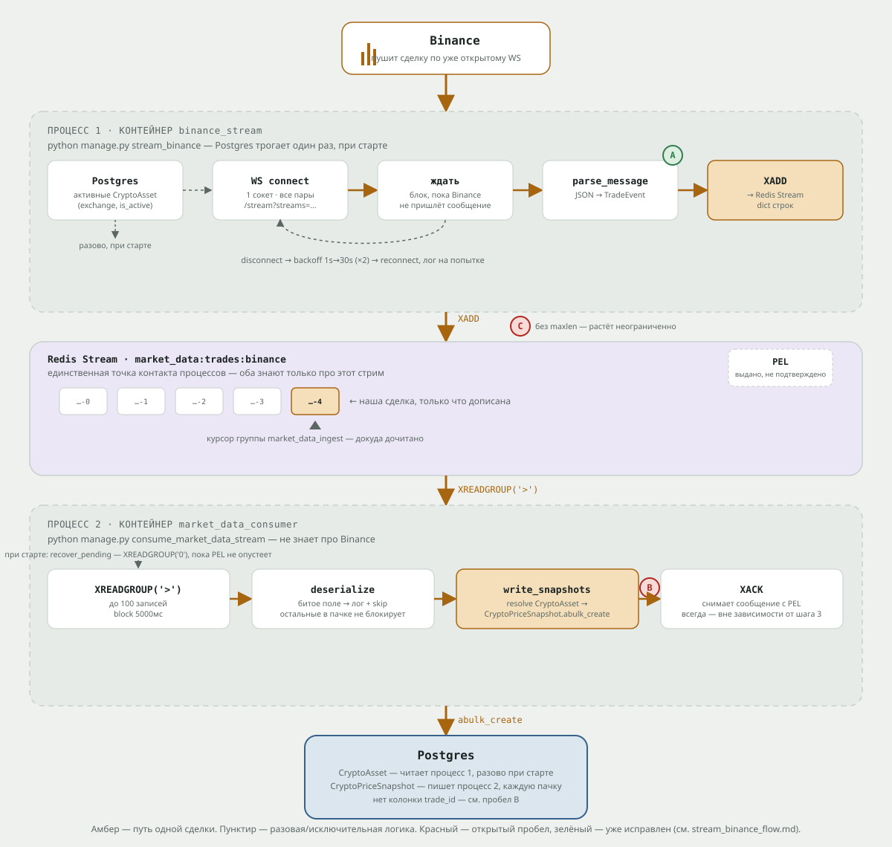

# Flow: сбор сделок с Binance (`stream_binance` → Redis → `consume_market_data_stream`)

Заметки по разбору пайплайна сбора рыночных данных. Не спецификация и не
проектная документация — конспект того, как это реально работает, на
момент текущей реализации.

## Схема



Янтарная линия — путь одной сделки, пунктир — разовая или исключительная
логика (чтение активных пар при старте, backoff при обрыве,
`recover_pending`). Красные маркеры **A**, **B** и **C** — это пробелы №6, №1
и №8 из раздела «Открытые вопросы» ниже, привязанные к конкретному шагу, на
котором они возникают.

## Общая картина

Два независимых процесса (в Docker — два разных контейнера), общаются
только через Redis Stream:

```
Binance WS  ──▶  stream_binance         Redis Stream          consume_market_data_stream  ──▶  Postgres
             (слушает биржу,        market_data:trades:...   (читает через consumer group,
              пишет в Redis)         (буфер на диске)          пишет CryptoPriceSnapshot)
```

`stream_binance` ходит в Postgres только за списком активных пар: при старте
и по событию изменения `CryptoAsset` (см. «Живая подписка» ниже). `consume_market_data_stream` вообще не знает
про Binance — только про Redis и модели.

**Порядок старта контейнеров.** `binance_stream` и `market_data_consumer`
читают/пишут те же таблицы, что создаёт `django` через `python manage.py
migrate`. Раньше оба контейнера стартовали параллельно с `django`
(`depends_on` ждал только запуска `postgres`/`redis`, не окончания миграций)
— на первом поднятии стека это было гонкой: `CryptoAsset.objects.filter(...)`
мог выполниться раньше, чем таблица вообще появится. Исправлено через
`healthcheck` (`python manage.py migrate --check`) на `django` и
`depends_on: {django: {condition: service_healthy}}` у обоих
контейнеров — они физически не стартуют, пока `django` не подтвердит
healthcheck'ом, что миграции накатаны (см. `docker-compose.local.yml` /
`docker-compose.production.yml`). В production у обоих также добавлен
`restart: unless-stopped` — раньше в файле не было `restart:` ни у одного
сервиса, и разовый сбой (например, кратковременная недоступность Redis)
убивал контейнер навсегда без автоматического перезапуска.

## Шаг 0. Предусловие (делается руками, один раз)

В БД должна существовать хотя бы одна запись:

```python
CryptoAsset(symbol="BTC", exchange="BINANCE", trading_pair="BTCUSDT", is_active=True)
```

Без неё `stream_binance` не откроет сокет и будет ждать события изменения
`CryptoAsset` (см. шаг 3 ниже) — перезапуск после добавления пары не нужен. `is_active` — это «собираем ли мы сейчас данные»,
не «торгуется ли актив ещё на бирже».

## Флоу `stream_binance`, шаг за шагом

Запуск: `python manage.py stream_binance`.

1. Django вызывает `Command.handle()` → `asyncio.run(self._run())`.
2. `_run()` запоминает id последней записи стрима изменений `CryptoAsset` (`resolve_start_id`), затем идёт в Postgres: `CryptoAsset.objects.filter(exchange=EXCHANGE, is_active=True).values_list("trading_pair", ...)`. Пример результата: `["BTCUSDT"]`. Порядок важен — см. «Живая подписка».
3. Если список пуст — лог INFO, сокет не открывается, процесс ждёт события изменения `CryptoAsset`.
4. Создаётся `BinanceProvider` и долгоживущий `BinanceTradeStreamConsumer` (`provider.trade_stream()`) — он хранит желаемый набор пар и переживает переподключения.
5. Под `asyncio.TaskGroup` запускаются две задачи: `_pump_trades` (сокет → Redis, шаги 6–11) и `_watch_asset_changes` (см. «Живая подписка»).
6. `async for event in consumer.stream():` — вот здесь впервые открывается сетевое соединение: **один** WebSocket на **все** пары сразу, URL вида `wss://stream.binance.com:9443/stream?streams=btcusdt@aggTrade`.
7. Процесс ждёт — ничего не делает, пока Binance не пришлёт сообщение по уже открытому сокету.
8. Кто-то в мире купил/продал BTC за USDT на Binance → биржа сама пушит JSON с этой сделкой по сокету (WS, не REST — не мы спрашиваем, а нам присылают).
9. `_parse_message` разбирает JSON в `TradeEvent(trading_pair, price, volume, side, timestamp, trade_id)`.
10. Цикл получает `event` и выполняет `redis_client.xadd(MARKET_DATA_TRADE_STREAM_KEY, serialize_trade_event(event))` — событие сериализуется в плоский dict строк и дописывается в Redis Stream. Это единственное место в этой команде, где что-то реально персистится вовне.
11. Возврат к шагу 7 — ждём следующую сделку. Цикл живёт вечно, пока процесс не остановят.

```
1 команда запущена
2 прочитали активные пары из Postgres
3 пар нет → ждём события / пары есть → идём дальше
4-5 подготовили provider/consumer, запустили две задачи
6-7 открыли ОДИН WS ко всем парам сразу, ждём
8 Binance прислал сделку по сокету
9 разобрали JSON → TradeEvent
10 XADD в Redis
11 → назад к 7, по кругу
```

## Живая подписка: изменения `CryptoAsset` без перезапуска

Раньше пары читались один раз при старте и зашивались в URL сокета: новая
или изменённая крипта в админке не стримилась до рестарта контейнера, а
рестарт — это потеря сделок по всем парам на время переподключения.

1. Сигналы в `signals.py` (`post_save`/`post_delete` на `CryptoAsset`; ресиверы только вызывают `services/crypto_asset_changes/triggers.py`, где живёт вся логика) на создание, изменение `exchange`/`trading_pair`/`is_active` или удаление шлют через `transaction.on_commit` событие в Redis Stream `MARKET_DATA_CRYPTO_ASSET_CHANGES_STREAM_KEY` (`market_data:crypto:asset_changes`, db 0). Изменение определяется без запроса в БД: `CryptoAsset.from_db` запоминает исходные значения полей. `QuerySet.update()`/`bulk_create` сигналов не вызывают — такие изменения стример не увидит до следующего события или рестарта.
2. Wire-контракт — `services/crypto_asset_changes/` (`schemas.py`, `serialization.py`), публикация — `publisher.py` (синхронная, ошибка Redis логируется ERROR и не пробрасывается), чтение — `listener.py`. Ретеншн — `MAXLEN ~ MARKET_DATA_CRYPTO_ASSET_CHANGES_MAXLEN` на каждом `XADD`: событие только повод для сверки, стримеру достаточно одного события после его последнего id.
3. `_watch_asset_changes` читает стрим `XREAD BLOCK` с последнего обработанного id. Стартовый id берётся **до** чтения БД: всё, что опубликовано раньше, уже закоммичено и видно в этом чтении; `$` не используется. Пачка событий схлопывается в одну сверку: перечитать активные пары из БД и вызвать `consumer.update_pairs(...)`. id сдвигается только после успешной сверки (ошибка БД — WARNING и повтор с backoff). После восстановления соединения с Redis — одна сверка без событий: публикация, пришедшаяся на недоступный Redis, иначе потерялась бы.
4. `update_pairs` считает разницу с подписками открытого соединения и шлёт в него `UNSUBSCRIBE`/`SUBSCRIBE` (`{"method": ..., "params": [...], "id": N}`) — без переподключения. Ответы Binance (`{"result": null, "id": N}` / `{"error": ..., "id": N}`) разбираются в `_parse_message` отдельно от сделок. Обрыв соединения во время отправки логируется WARNING и не пробрасывается: переподключение возьмёт в URL актуальный набор. Пустой набор — соединение закрывается, `stream()` ждёт пар.

## Флоу `consume_market_data_stream` (второй, параллельный процесс)

Запускается отдельно, в другом терминале/контейнере, **параллельно** со
`stream_binance` — это два разных процесса, которые ничего друг о друге не
знают напрямую и общаются только через Redis Stream.

Запуск: `python manage.py consume_market_data_stream`.

Продолжаем тот же сквозной пример: `stream_binance` только что записал в
Redis (`XADD`) сделку `TradeEvent(trading_pair="BTCUSDT", price=95000,
volume=0.5, side="buy", ...)`. Дальше — что происходит в **этом**, втором
процессе.

1. Django вызывает `Command.handle()` → `asyncio.run(self._run())` — как и у `stream_binance`, только код внутри другой.
2. `_run()` создаёт клиент Redis и `ingest = CryptoTradeIngestService(exchange=EXCHANGE)` — объект, который умеет резолвить `CryptoAsset` и писать `CryptoPriceSnapshot` (сам ещё ничего не делает).
3. `await self._ensure_group(redis_client)` — пытается создать consumer group `XGROUP CREATE market_data:trades:binance market_data_ingest id=0 mkstream=True`:
   - если группы ещё не было — она создаётся, `id="0"` значит «группа видит вообще все сообщения в стриме, включая уже лежавшие там до её создания»;
   - если группа уже существует (обычная ситуация — контейнер просто перезапустили) — Redis вернёт ошибку с текстом `BUSYGROUP`, код её ловит, логирует info и идёт дальше как ни в чём не бывало;
   - любая другая ошибка Redis — пробрасывается наружу, процесс падает (осознанно: если тут что-то не так, лучше упасть сразу, чем работать вслепую).
4. `await self._recover_pending(redis_client, ingest)` — прежде чем читать новое, процесс проверяет: не осталось ли с **прошлого** запуска сообщений, которые были ему выданы, но не были заackнуты (см. подробно про PEL в разделе ниже). Если таких нет — метод сразу выходит, ничего не делая. Если есть — они обрабатываются точно так же, как в шаге 7 (тем же `_process_batch`), пока PEL не опустеет.
5. Начинается бесконечный цикл. Каждую итерацию — `XREADGROUP(streams={STREAM_KEY: ">"}, count=settings.MARKET_DATA_TRADE_READ_COUNT, block=settings.MARKET_DATA_TRADE_READ_BLOCK_MS)`. Это значит: «дай мне до 100 ещё не выданных сообщений; если их сейчас нет — подожди до 5000 мс, вдруг появятся, и только потом верни пустой ответ».
6. Как только наша сделка `BTCUSDT/95000` (записанная в Redis на шаге 10 флоу `stream_binance`) доходит до этого `XREADGROUP` — она попадает в ответ. Если бы её не было и никто вообще не стримил — `XREADGROUP` просто ждал бы 5 секунд, вернул пустой ответ, и код (`if not _has_messages(response): continue`) ушёл бы на новую итерацию ждать снова.
7. Ответ непустой → вызывается `self._process_batch(redis_client, ingest, response)`. Внутри неё, для каждого сообщения в пачке:
   1. `deserialize_trade_event(fields)` превращает плоский dict строк обратно в `TradeEvent(trading_pair="BTCUSDT", price=Decimal("95000"), ...)`.
   2. Если поля битые/отсутствуют — ловится `MALFORMED_TRADE_EVENT_ERRORS` (`KeyError`/`ValueError`/`ArithmeticError`), пишется `logger.exception(...)`, и это конкретное сообщение просто не попадает в список `events` — остальные из той же пачки это не блокирует.
8. Собранный список `events` (в нашем примере — один `TradeEvent`) идёт в `await ingest.write_snapshots(events)` — метод асинхронный сам по себе (нативный async ORM Django, без `sync_to_async`): внутри резолвится `CryptoAsset` по `(exchange="BINANCE", trading_pair="BTCUSDT")` — та самая запись из Шага 0 — через `async for asset in CryptoAsset.objects.filter(...)`, и создаётся `CryptoPriceSnapshot(asset=<этот CryptoAsset>, price=95000, volume=0.5, timestamp=...)` через `await CryptoPriceSnapshot.objects.abulk_create(...)`. **Вот в этот момент сделка впервые оказывается в Postgres.**
9. Если на этом шаге что-то упало (например, БД недоступна) — широкий `except Exception` ловит это, логирует и **не пробрасывает дальше**. Это осознанное решение — иначе одна неудачная запись положила бы весь процесс.
10. Независимо от того, как прошёл шаг 8/9 — вызывается `XACK` по всем ID сообщений из этой пачки. Именно это «вычёркивает» их из PEL и говорит Redis'у «эти сообщения больше никому не нужно выдавать».
11. Возврат к шагу 5 — ждём следующую пачку. Цикл живёт вечно, пока процесс не остановят.

```
1   команда запущена
2   подготовили redis-клиент и CryptoTradeIngestService
3   создали (или переиспользовали) consumer group
4   дочитали "хвосты" с прошлого запуска, если были (PEL)
5-6 XREADGROUP(">") — ждём/получаем новые сообщения из Redis
7   есть сообщения → _process_batch
7.1-7.2  разобрали каждое сообщение в TradeEvent, битые — в лог и мимо
8   write_snapshots() → CryptoAsset резолвлен, CryptoPriceSnapshot создан в Postgres
9   если запись упала — залогировали, но не уронили процесс
10  XACK всей пачки — в любом случае
11  → назад к 5, по кругу
```

Итого: сделка проходит путь `Binance → stream_binance (XADD) → Redis Stream
→ consume_market_data_stream (XREADGROUP → write_snapshots → XACK) →
Postgres`, и именно на шаге 8 второго процесса она становится видимой
строчкой в `CryptoPriceSnapshot` — до этого момента она просто лежит в
Redis и никому, кроме второго процесса, не видна.

## Как работает Redis Stream под капотом

- **XADD** — просто дописать запись в конец лога, Redis сам генерит ID (`<ts>-<seq>`). Продюсер ничего не ждёт в ответ.
- **Consumer Group** — объект внутри стрима, который помнит: докуда группа дочитала + какие сообщения выданы, но не подтверждены (**PEL**, Pending Entries List).
- **XREADGROUP(id=">")** — «дай новое». В момент выдачи сообщения автоматически попадают в PEL текущего consumer name.
- **XACK** — убирает сообщение из PEL. Если его не вызвать — сообщение так и висит в PEL.
- **XREADGROUP(id="0")** — не «новое», а «то, что уже висит в PEL этого consumer name» — используется в `_recover_pending` после рестарта.

Сценарий падения: процесс прочитал 100 сообщений (они в PEL), записал 60 в
Postgres, упал до `XACK`. При рестарте `_recover_pending` вычитывает эти же
100 из PEL заново и обрабатывает. Сообщение не теряется — это и есть
**at-least-once delivery**. Но не **exactly-once**: если `write_snapshots`
успел выполниться, а `XACK` — нет, при рестарте эти события запишутся в
Postgres второй раз (нет уникальности по `trade_id` в `CryptoPriceSnapshot`).

## Открытые вопросы / известные пробелы (на момент разбора)

1. **Дублирование при падении между записью и XACK** — нет идемпотентности по `trade_id`, см. выше.
2. **`fetch_history` (бэкфилл через REST `klines`) реализован и покрыт тестами, но нигде не вызывается** — ни одна команда его не использует.
3. **`FiatCurrency`/`FiatPriceSnapshot` — только модели**, провайдера MOEX/ЦБ РФ нет.
4. **Нет теста на саму команду `stream_binance`** (есть на provider/rest/ws/ingest/trade_stream/consume-команду).
   Живая подписка (см. выше) добавила в команду вторую задачу — тест особенно нужен.
5. **`CryptoAsset.exchange` — свободный `CharField` без `choices=`.** Опечатка регистра (`"Binance"` вместо `"BINANCE"`) молча даст пустой список пар в `stream_binance`, без явной ошибки валидации.
6. ~~Валидация полей внутри WS-сообщения Binance неполная.~~ **Исправлено.** Раньше проверялась только форма конверта (`data` есть, `e == "aggTrade"`), а битое/пропущенное поле внутри самого `aggTrade`-payload (`p`/`q`/`s`/`T`/`a`) роняло `KeyError`/`decimal.InvalidOperation` мимо `except (ConnectionClosed, OSError, json.JSONDecodeError)` в `stream()` и валило весь процесс `binance_stream`. Теперь построение `TradeEvent` внутри `_parse_message` обёрнуто в `try/except Exception` — битое сообщение логируется (`logger.exception`) и пропускается, сокет не рвётся, счётчик переподключений не растёт. Покрыто тестом `test_stream_skips_malformed_agg_trade_fields_without_reconnecting`.
7. **Лимиты Binance WS:**
   - 5 входящих сообщений/сек (включая PING/PONG) — `SUBSCRIBE`/`UNSUBSCRIBE` живой подписки идут не чаще раза в `CONTROL_MESSAGE_MIN_INTERVAL_SECONDS` (0.35 с), с запасом под pong; одна сверка — не больше двух сообщений (плюс чанки по `MAX_PARAMS_PER_REQUEST`).
   - 1024 стрима на соединение — потолок `MAX_STREAMS_PER_CONNECTION`: сверх него ERROR в лог и подписка на первые 1024 пары по алфавиту, команда не падает. Шардирования по нескольким сокетам нет. При сотнях пар длинным становится и URL переподключения.
   - 300 попыток подключения/5мин на IP — соблюдён с запасом: backoff 1s→30s (×2, cap 30s) даёт ~14 попыток в худшем случае за 5 минут, плюс архитектура «один сокет на все пары» (не по сокету на пару).
8. **`XADD` в `stream_binance.py` вызывается без `maxlen`/трimming.** Redis Stream `market_data:trades:binance` растёт неограниченно. Пока `consume_market_data_stream` не отстаёт — не проблема: `XREADGROUP` читает пачками по `MARKET_DATA_TRADE_READ_COUNT` (100), backlog в миллион записей консьюмер просто долго досчитывает, не падая (память процесса не растёт, каждая пачка маленькая и ограниченная). Но если консьюмер долго не работает (упал, простой при деплое, недоступна БД), а `stream_binance` продолжает писать — упрётся в память не консьюмер, а сам Redis-инстанс: неограниченный рост стрима ничем не остановлен.
